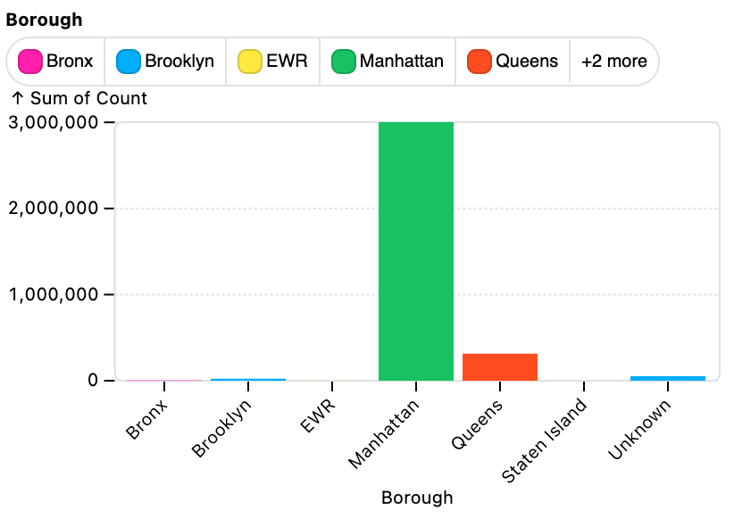

# DuckPlot 🦆📈

DuckPlot is a JavaScript library that allows you to quickly generate charts with
[Observable Plot](https://github.com/observablehq/plot) when working with [DuckDB](https://duckdb.org/). It allows you to easily configure, prepare, and visualize your data, whether
you are running in a Node.js environment or in the browser.

## Motivation

Imagine you have this table of taxi rides in your DuckDB instance:

| Date       | Count | Borough       |
| ---------- | ----- | ------------- |
| 2023-01-01 | 1     | Bronx         |
| 2023-01-01 | 4     | Manhattan     |
| 2022-12-31 | 144   | Bronx         |
| 2022-12-31 | 691   | Brooklyn      |
| 2022-12-31 | 9     | EWR           |
| 2022-12-31 | 74415 | Manhattan     |
| 2022-12-31 | 8512  | Queens        |
| 2022-12-31 | 12    | Staten Island |
| 2022-12-31 | 1292  | Unknown       |
| 2022-12-30 | 148   | Bronx         |

To generate this chart of the number of taxi rides per borough, you can use
DuckPlot:

<div style="display: flex; align-items: flex-start; flex-wrap: no-wrap;">
  
  <pre style="margin-left: 10px;">
<code>
duckplot
  .table("taxi")
  .columns({ x: "Borough", y: "Count", series: "Borough" }) // Columns of interest
  .mark("barY") // Observable Plot mark type
  .render(); // Generate the plot
</code>
  </pre>
</div>

This demonstrates the major features of the library:

- Performs **data transformations** and aggregations with DuckDB before
  rendering
- Automatically **adjusts the margins** and axis ticks labels for better
  readability
- Creates **custom legends** for categorical data
- Supports both **client and server** environments
- Uses a **method chaining** API for easy configuration

## Installation (⚠️ NPM build not actually ready yet)

You can install DuckPlot via npm:

```bash
npm install duck-plot
```

## Usage

### Basic Example

Here’s a basic example of how to use DuckPlot to create a line plot.

```javascript
import { DuckPlot } from "duck-plot";
// Assumes you have a DuckDB instance named `dbd` and a table named `my_table`
const duckPlot = new DuckPlot(ddb);
duckPlot
  .table("my_table")
  .columns({ x: "date", y: "cost", series: "company", fy: "department" })
  .mark("line");
const svg = await duckPlot.render();
document.body.appendChild(svg);
```

### DuckPlot Class Methods

**Constructor Arguments:**

```javascript
constructor(
  ddb: AsyncDuckDB,
  { jsdom, font }: { jsdom?: JSDOM; font?: any } = {}
)
```

- **`ddb: AsyncDuckDB`**

  - **Description:** The DuckDB instance to be used for querying and data manipulation.
  - **Type:** `AsyncDuckDB`

- **`{ jsdom, font }: { jsdom?: JSDOM; font?: any }`**
  - **Description:** An optional configuration object for server-side rendering.
  - **Parameters:**
    - **`jsdom` _(optional)_**: An instance of JSDOM for creating a simulated DOM environment when running on the server.
      - **Type:** `JSDOM`
    - **`font` _(optional)_**: An opentype.js loaded font object used for
      measuring text length on the server
      - **Type:** `any`

The `DuckPlot` class offers a set of methods to configure and render your plots
effectively. Below are the primary methods available:

**`.table(string?)`**

- **Description:** Sets the table name.
- **Parameters:**
  - `table`: The name of the table to be used for plotting.

**`.columns({x: string, y: string, series?: string, fy?: string})`**

- **Description:** Defines the columns of interest for the plot.
- **Parameters:**
  - `x`: The column to be used for the x-axis.
  - `y`: The column to be used for the y-axis.
  - `series` _(optional)_: The column used to group data by series.
  - `fy` _(optional)_: The column used for fying the plot.

**`.mark("line" | "barY" | "areaY" | "dot" | "barX")`**

- **Description:** Sets the type of plot. Options correspond to Observable Plot mark types.
- **Parameters:**
  - The type of plot, chosen from `"line"`, `"barY"`, `"areaY"`, `"dot"`, or `"barX"`.

**`.config({xLabel?: string, yLabel?: string, legendLabel?: string, width?: number, height?: number, xLabelDisplay?: boolean, yLabelDisplay?: boolean, legendDisplay?: boolean, hideTicks?: boolean, color?: string, r?: number})`**

- **Description:** Configures various settings for the plot.
- **Parameters:**
  - `xLabel` _(optional)_: Label for the x-axis.
  - `yLabel` _(optional)_: Label for the y-axis.
  - `legendLabel` _(optional)_: Label for the legend.
  - `width` _(optional)_: Width of the plot.
  - `height` _(optional)_: Height of the plot.
  - `xLabelDisplay` _(optional)_: Boolean to display the x-axis label.
  - `yLabelDisplay` _(optional)_: Boolean to display the y-axis label.
  - `legendDisplay` _(optional)_: Boolean to display the legend.
  - `hideTicks` _(optional)_: Boolean to hide axis ticks.
  - `color` _(optional)_: Color used for the plot elements.
  - `r` _(optional)_: Radius for dot elements in the plot.

**`.render()`**

- **Description:** Prepares and generates the plot.
- **Returns:** An HTML `Div` element containing the rendered plot.

The `.data`, `.columns`, `.type`, and `.config` methods are **getter**/**setter** methods, meaning they can be used to both set and get the values. For example, you can use the `.data` method to set the data source and the `.data` method without any parameters to get the data source.

```javascript
const duckPlot = new DuckPlot().data({ ddb: db, table: "my_table" }); // sets the data source

duckPlot.data(); // gets the data source
```

## Data Transformations

TODO: Add a description of the data transformations that DuckPlot can perform.

**Note**: Data transformations are only re-run when necessary, so if you update
the `.config` and re-render the plot, the data transformations will not be re-run.

## Development

To locally develop DuckPlot, clone the repository and install the dependencies
with `npm install`.

- To view examples in the browser, run `npm run dev` and open `http://localhost:8008/`
- To view examples in the server, run `npm run dev-server` and view
  the outputted `.html` files in `examples/server-output`

- For an example creating multiple plots from a single data source, run `npm run
dev-multi-chart`, and see the outputted files in `examples/server-output`

Examples can be easily added to the `examples/` directory (and need to be
exported by the `examples/plots/index.js` file) to test new features. For
example, here is the [line chart](examples/plots/line.js) example:

```javascript
import { renderPlot } from "../util/renderPlotClient.js";
// This code is both displayed in the browser and executed
const codeString = `
duckplot
  .data({ ddb: db, table: "income" })
  .columns({ x: "month", y: "consensus_income"})
  .mark("line")
`;

export const line = (duckplot) =>
  renderPlot(duckplot, "income.csv", codeString);
```

If you're actively developing DuckPlot, you can run `npm run watch:build` to watch for changes in the `src/` directory and automatically recompile the TypeScript code.

## Testing

Run `npm run test` to test

## Implementation notes

Because DuckDB has different APIs for
[WASM](https://duckdb.org/docs/api/wasm/overview.html) and [Node.js](https://duckdb.org/docs/api/nodejs/overview), DuckPlot uses a conditional import to load the appropriate DuckDB API based on the environment.

Performing axis adjustments on the server requires measuring the text width of
the axis labels. This is done using `opentype.js`. You can pass in your own font
for more precise measurements.

## License

This project is licensed under the MIT License.
